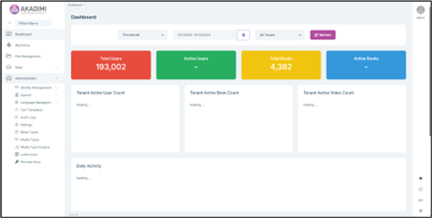

# Application Features and Modules

## Admin Dashboard Overview
The admin dashboard serves as the control center for managing and organizing all content within Akadimi. Key features include:
- **Upload Books**: Admins can easily upload books and other reading materials to the platform.
- **Customize Book Information**: Admins can edit metadata like tags, authors, and publishers for easier categorization and improved search functionality.
- **Publish Books**: After customizing the book details, admins can publish the content, making it accessible to users in both the web and desktop (Electron) versions.
- **User Roles & Permissions**: Admins can define user roles (e.g., admin, editor, reader) and assign specific permissions for content management.
- **Advanced Analytics**: The dashboard provides detailed statistics for each tenant, including total and active users, books, and videos, as well as daily activity, operating system usage, AI panel interactions, and the top 10 active videos and books. This empowers admins with insights to monitor engagement, optimize performance, and improve content offerings.

   
    
   <small><em>Admin Dashboard</em></small>
     
  
## Accessing Akadimi as a User (Frontend)
Users can access Akadimi via the web or desktop (Electron) versions. Upon logging in, they are directed to the home page or the library channel, where they can browse, search, and filter books based on various criteria.

<small><em>Akadimi Front-End Interface</em></small>
  

### Core Features

#### 1. Book Reading View
The reading view provides an immersive experience with the following features:
- **Page Thumbnail Navigation**: Thumbnails of all book pages are displayed, allowing users to jump to any section of the book quickly.
- **Zoom & Rotate Tools**: Users can zoom in on important text or rotate the page to improve visibility of charts and diagrams. This enhances the readability of content-rich materials.

#### 2. Backpack Feature
The backpack feature allows users to store multiple books in a virtual space for easy access. This is particularly useful for students conducting research or teachers preparing lessons using several sources simultaneously. Users can easily switch between books without opening and closing multiple files.

#### 3. Bookmarks
Users can create bookmarks to mark important pages or sections for quick reference. This is a helpful feature for students preparing for exams or teachers preparing specific topics for class discussions.

#### 4. Annotations
Akadimi enables users to annotate books with various tools:
- **Notes**: Add written comments on any page to document thoughts or reflections.
- **Highlighting Text**: Highlight important sections in different colors for easy reference.
- **Shapes**: Draw shapes like circles or arrows to emphasize key areas of a page, diagrams, or charts.
- **Stamps**: Apply stamps (e.g., "Important," "Question," or custom stamps) to highlight specific sections for attention.

These tools allow users to engage more deeply with content and create interactive reading material.

#### 5. Akadimi AI Tools
Akadimi incorporates AI-driven tools to enhance the learning experience:
- **Page Summaries**: Automatically generated summaries of each page to help users quickly grasp key concepts.
- **Keyword Extraction**: AI extracts key terms from the text to highlight important concepts and terminology.
- **Related Videos**: AI fetches relevant videos related to the current page’s topic for further learning.
- **AI Chatbot**: Users can ask questions about the book’s content, and the chatbot provides instant answers, utilizing natural language processing to respond contextually.

These AI tools streamline learning, offer instant support, and expand educational resources beyond traditional reading.

## Differences Between Web and Electron Versions
Both the web and Electron versions of Akadimi share the same core features but differ slightly in navigation and user interface:
- **Web Version**: Provides faster online access without the need for installation.
- **Electron Version**: Offers a more stable offline reading experience and supports additional features such as the Backpack, Video Library, and support for local upload books.

